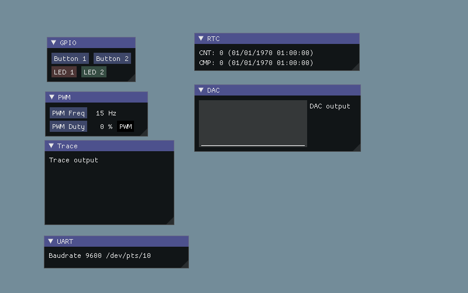

# SoCSIM

[](https://github.com/mariusmm/RISC-V-TLM/blob/master/LICENSE)
[](https://twitter.com/mariusmonton)

SoC Simulator is a simple SoC (System-on-chip) + Board emulator intended to practice programming in FreeRTOS
for a MCU. 

It uses [freertos-addons](https://github.com/michaelbecker/freertos-addons) to allow using FreeRTOS on a Linux box.
Edit Makefile to point variables to installation directory.
It uses [imgui](https://github.com/ocornut/imgui) to build a GUI to show input/output and devices virtually 
connected to the MCU. Current set-up uses SDL and OpenGL implementation.




The emulator includes a HAL ([HAL.h](SIM/HAL.h)) to interface with the emulated Hardware.

The Hardware is emulated in the following files:
- [Memory](SIM/Memory.h) emulates a memory map. 
- [SoC](SIM/SoC.h) emulates behaviour of MCU + Board.  


## License

This project is licensed by GPLv3. See LICENSE file for more details.

## Installation

It is required a C/C++ compiler compatible with C++17. Tested with gcc 10.2.0 on ubuntu.

```
git clone https://github.com/FreeRTOS/FreeRTOS-Kernel.git
git clone https://github.com/michaelbecker/freertos-addons.git
git clone git@github.com:mariusmm/SoCSIM.git
cd SoCSIM
```

## Build
Build is based on cmake, so in SoCSIM directory run the following commands: 
```
mkdir build
cd build
cmake ..
make
./SoCSIM
```

## Build documentation
```
cd build
make doc
```

The documentation is generated in doc/ directory in html and latex format.
In case you want to generate pdf from latex, you need to run ```make``` in the doc/latex/ directory

## Virtual peripherals

### GPIO

There are 4 GPIO ports (PORTA, PORTB, PORTC & PORTD). 

- Button 1 is connected to PORTA, pin #0
- Button 2 is connected to PORTB, pin #1
- LED 1 is connected to PORTC, pin #7
- LED 2 is connected to PORTD, pin #12

### Interrupt Controller

There is a basic Interrupt Controller with only two registers, NVIC_CTRL 

### PWM TIMER

This timer is only able to generate a PWM signal, it counts from 0 to value ADDR_TIMER_TOP and starts over. 
When timer value is less than ADDR_TIMER_CMP output is '0', when greater output is '1'. 

Timer input clock runs at 16 MHz and can be pre-scaled by a value from 1 to 256 (power of 2 only). 

### RTC

A very basic timer, with 1 second precision that store unix epoch in a register (32 bits).
It also has a compare register to trigger an IRQ in a date. 

### TRACE

An ITM-like peripheral with a single register that prints out the characters written to its data register

### DAC

DAC peripheral able to generate a signal between 0 and 1 volts. The DAC works a 10 samples/second.

## Memory map

All registers are 32 bit width.

| Address | Register | Comment |
| ---- | ---- | ---- |
| 0x1000 | GPIO A CTRL | 1 - out , 0 - in |
| 0x1004 | GPIO A INT | 1 - Interrupt enable, 0 - Disabled | 
| 0x1008 | GPIO A OUT | '1' or '0' set to output pin |
| 0x100C | GPIO A IN | '1' or '0' set by the input pin |
| 0x2000 | GPIO B CTRL | idem |
| 0x2004 | GPIO B INT | idem |
| 0x2008 | GPIO B OUT | idem |
| 0x200C | GPIO B IN | idem |
| 0x3000 | GPIO C CTRL | idem |
| 0x3004 | GPIO C INT | idem |
| 0x3008 | GPIO C OUT | idem |
| 0x300C | GPIO C IN | idem |
| 0x4000 | GPIO D CTRL | idem |
| 0x4004 | GPIO D INT | idem |
| 0x4008 | GPIO D OUT | idem |
| 0x400C | GPIO D IN | idem |
| 0xA000 | INTERRUPT CTRL | TBD |
| 0xA004 | INTERRUPT IRQ | TBD |
| 0xC000 | ADDR TIMER CTRL | Prescaler (15:8),  |
| 0xC000 | ADDR TIMER TOP | Top value |
| 0xC000 | ADDR TIMER CNT | Timer counter value |
| 0xC000 | ADDR TIMER CMP | Compare value |
| 0xD000 | ADDR RTC CTRL | RTC control register |
| 0xD004 | ADDR RTC CNT  | RTC epoch time |
| 0xD008 | ADDR RTC CMP  | RTC compare register |
| 0xF000 | ADDR TRACE  |  ITM like tracer | 
| 0x10000 | ADDR DAC CTRL |  DAC control register | 
| 0x10004 | ADDR DAC DATA | DAC sample register |   
 
